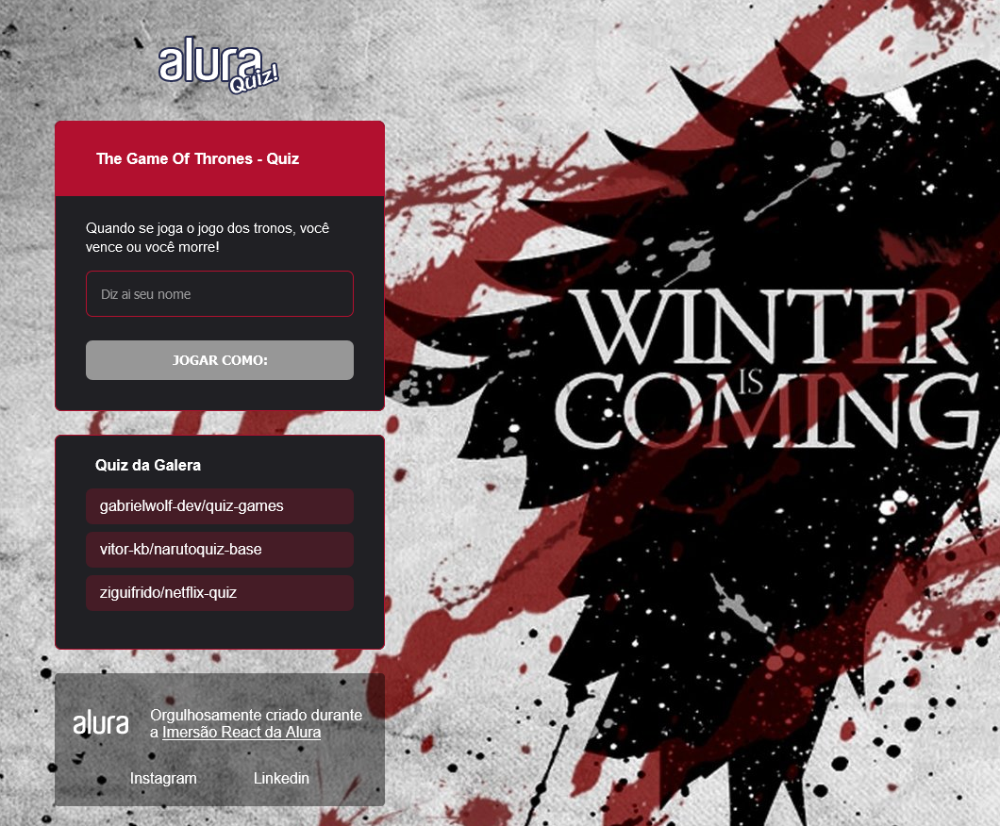

# Alura Imersao React - Quiz with Next JS

> Quiz Next JS

# :pushpin: Table of Contents

- [Features](#rocket-features)
- [UI Documentation](#framed_picture-ui-documentation)
- [Installation](#construction_worker-installation)
- [Getting Started](#runner-getting-started)
- [FAQ](#postbox-faq)
- [Found a bug? Missing a specific feature?](#bug-issues)
- [License](#closed_book-license)

 

# :rocket: Features

- Only HTML, CSS, Javascript and JQuery
- JS Logic

# :framed_picture: UI Documentation

This project has a UI Documentation of reusable components, allowing to test them individually.

   

# :construction_worker: Installation

**You need to install [NPM](https://www.npmjs.com/) and [YARN](https://yarnpkg.com/) first, then in order to clone the project via HTTPS, run this command:**

`git clone https://github.com/matheus13f/Podcast_NextJS.git`

SSH URLs provide access to a Git repository via SSH, a secure protocol. If you have a SSH key registered in your Github account, clone the project using this command:

`git clone git@github.com:matheus13f/Podcast_NextJS.git`

**Install dependencies**

You need to install the dependencies of the project, so **run the above command on root folder**:

`yarn`
or
`npm i`

# :runner: Getting Started

Run the following command to start the application in a development environment:

`yarn start`
or
`npm start`

Run the following command to start the api in a development environment:

`yarn server`

`Happy code \{^-^}/`

# :postbox: Faq

**Question:** What are the technologies used in this project?

**Answer:** The technologies used in this project are [React JS](https://pt-br.reactjs.org/), [Typescript](https://www.typescriptlang.org/), [Next.JS](https://nextjs.org/) and [Styled Components](https://styled-components.com/)

# :bug: Issues

Feel free to **file a new issue** with a respective title and description on the [Quiz](https://github.com/matheus13f/AluraQuiz-NextJs/issues) repository. If you already found a solution to your problem, **i would love to review your pull request**!

# :closed_book: License

Released in 2020.
This project is under the [MIT license](https://github.com/matheus13f/AluraQuiz-NextJs/master/LICENSE).
